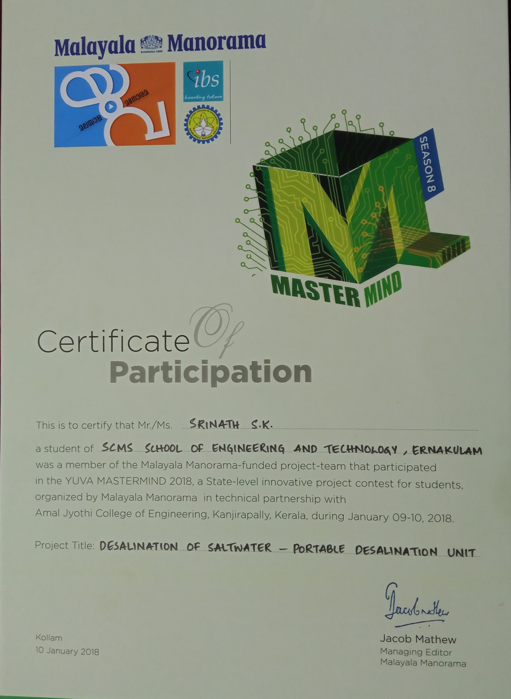

# Instaqua - A portable desalination unit
Research project for developing recyclable electrodes for Capacitive deionization.

# Project description

A breakthrough in water purification and desalination. Instaqua consumes less than a unit of electricity for desalinating a cubic meter of water. The technology consumes only a fraction of energy to desalinate water; incorporating Solar power technology; Instaqua remains to be 100% eco-friendly. The research extended from `2016` - `2018`, has led to the prototyping of this product. 

`Instaqua is still being researched and tested to improve its efficiency.`
[View project documentation](./docs.pdf)

# Certificate

